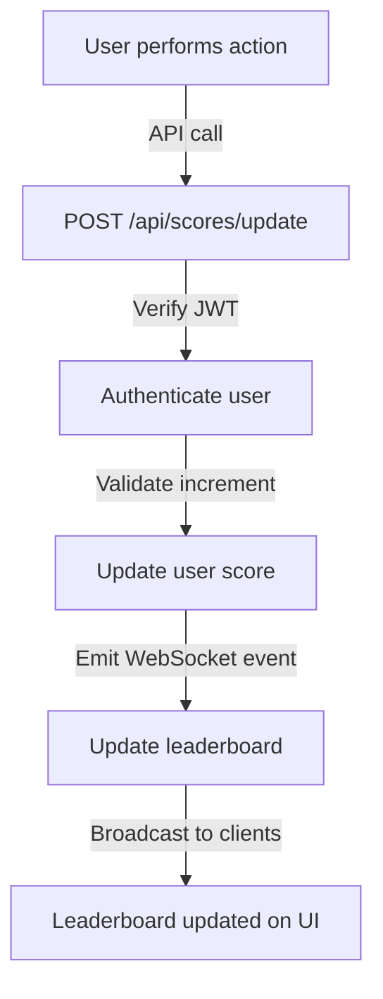

# Scoreboard API Module Specification

## Overview

This module is responsible for managing and updating the user scoreboard. It ensures that user scores are updated securely and efficiently, providing real-time updates to the leaderboard displayed on the website.

## Features

- API endpoint to update user scores.
- Real-time update of the scoreboard using WebSockets.
- Secure score updates with authentication and validation.
- Persistent storage of user scores.
- Fetching the top 10 user scores.

## API Endpoints

### 1. Update Score

**Endpoint:** `POST /api/scores/update`

**Description:** Increments the user's score upon completion of an action.

**Request Headers:**

- `Authorization: Bearer <JWT_TOKEN>`

**Request Body:**

```json
{
  "userId": "123456",
  "increment": 10
}
```

**Response:**

```json
{
  "success": true,
  "message": "Score updated successfully",
  "score": 150
}
```

**Security Measures:**

- Authentication via JWT.
- Validation to ensure a user can only increment their own score.
- Rate limiting to prevent spam attacks.
- Request signature validation to ensure request integrity.

---

### 2. Get Leaderboard

**Endpoint:** `GET /api/scores/leaderboard`

**Description:** Retrieves the top 10 users with the highest scores.

**Response:**

```json
{
  "success": true,
  "leaderboard": [
    { "userId": "123", "score": 500 },
    { "userId": "456", "score": 450 }
  ]
}
```

**Security Measures:**

- Cached response to reduce database load.
- Read-only access with no authentication required.

## Real-Time Updates

The application server will use **WebSockets (Socket.io or similar technology)** to push real-time updates to the scoreboard whenever a score changes.

1. When a score is updated, the server will emit an event: `scoreUpdated`.
2. Clients subscribed to the WebSocket will receive the updated leaderboard data.

## Database Schema (Example using PostgreSQL)

```sql
CREATE TABLE users (
  id UUID PRIMARY KEY,
  username VARCHAR(255) NOT NULL,
  score INT DEFAULT 0
);
```

## Execution Flow Diagram



## Improvement Suggestions

1. **Anti-Cheat Measures:** Implement score change logging and anomaly detection to prevent suspicious score increments.
2. **Leaderboard Caching:** Use Redis or another caching mechanism to optimize leaderboard fetching.
3. **Rate Limiting:** Introduce API rate limits to prevent abuse of the update endpoint.
4. **Database Indexing:** Ensure the `score` column is indexed for fast leaderboard queries.
5. **Audit Logging:** Log score changes for debugging and fraud detection.

## Implementation Considerations

- Use **NestJS or Express.js** with TypeScript for backend API.
- Use **JWT authentication** for securing score updates.
- Use **Redis for caching** leaderboard data.
- Use **Socket.io or WebSockets** for real-time scoreboard updates.
- Use **PostgreSQL or MongoDB** for storing user scores.

## Conclusion

This module provides a secure and scalable approach to managing a real-time scoreboard, ensuring fair play while optimizing performance.

